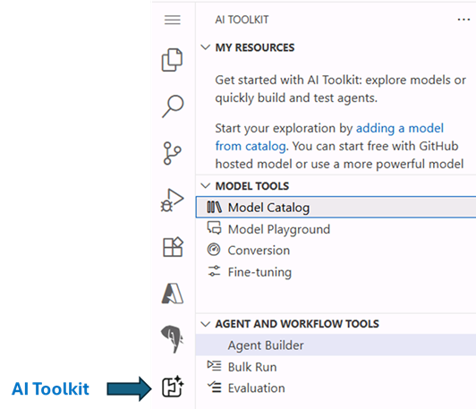

# Get started

> [!TIP]
> What is the **Azure AI Toolkit(AITK)**? [The AI Toolkit (AITK)](https://code.visualstudio.com/docs/intelligentapps/overview) is an extension for Visual Studio Code that provides a unified interface to access and interact with various AI models and services. It allows users to easily explore, compare, and utilize different AI models from multiple providers, both proprietary and open source, hosted on several platforms, such as Github, Azure AI Foundry or even locally. With AITK, developers can streamline their Generative AI development workflow by integrating model selection, prompt engineering, and agent prototyping and testing directly within their code editor.

## Open workshop in a GitHub Codespace

In this workshop, we will be using **GitHub Codespaces** to launch a cloud-hosted development environment with all the necessary tools and dependencies pre-installed. This will allow you to focus on learning and prototyping without worrying about local setup.

1. Open the browser and navigate to the [GitHub repo](https://aka.ms/msignite25-lab512) hosting the lab assets.

2. To launch a codespace, you need a **GitHub account**.

    > [!NOTE]
    > If you already have a GitHub account, you can move to step 3 directly.

    To create one, click on the **Sign up** button and follow the instructions below:
    - In the new window, enter a personal email address, create a password, and choose a username.
    - Select your Country/Region and agree to the terms of service.
    - Click on the **Create account** button and wait for the verification email to arrive in your inbox.

    

    - Copy the verification code from the email and paste it into the verification field on the GitHub website. Then click on **Continue**.
    - Once the account is created, you'll be redirected back to the GitHub repo page and you'll see a green banner at the top, like the one in the screenshot below.

    

3. Click on **Sign in** and enter your GitHub credentials to log in. If you just created your account, use the username and password you set during the sign-up process.

4. Next, click on the green **Code** button and select **Create codespace on main** from the dropdown menu.

    

5. Once the codespace is created, you'll see a Visual Studio Code environment loading in your browser. You might choose to continue working in the browser or click on the **Open in VS Code** button to open it in the desktop application (if you have it installed in your machine).

    

## Verify AI Toolkit extension is installed

In the GitHub Codespace, you should be able to see - among the Visual Studio Code extensions already installed - the **AI Toolkit**. This is the extension we will be using to interact with various AI models and services in this lab.

> [!TIP]
> If you don't see the extension icon, click on the ellipsis (...) at the bottom of the sidebar to see the full list of installed extensions.

## Ready to start

That covers the necessary setup to work with the AI Toolkit in VScode and Azure AI Foundry hosted models. We will now move forward to begin exploring the Model Catalog and interacting with the models.
Click **Next** to proceed to the following section of the lab.