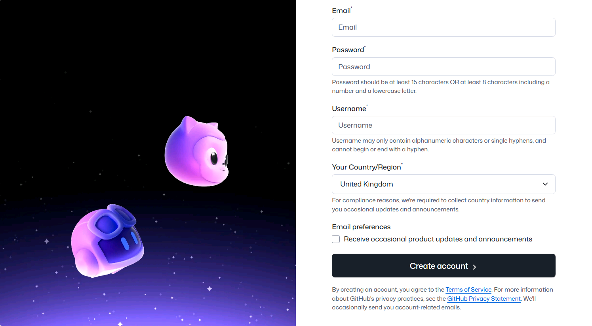
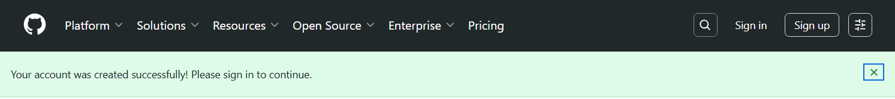
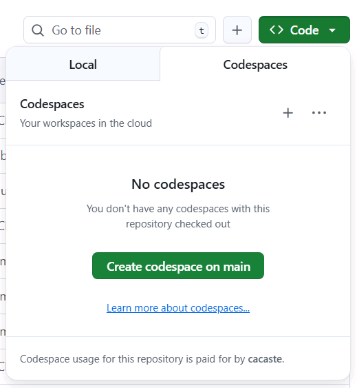
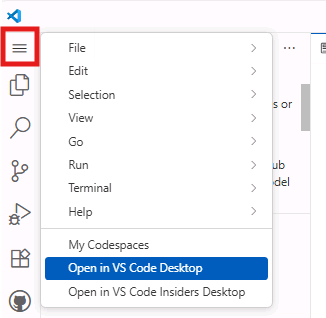
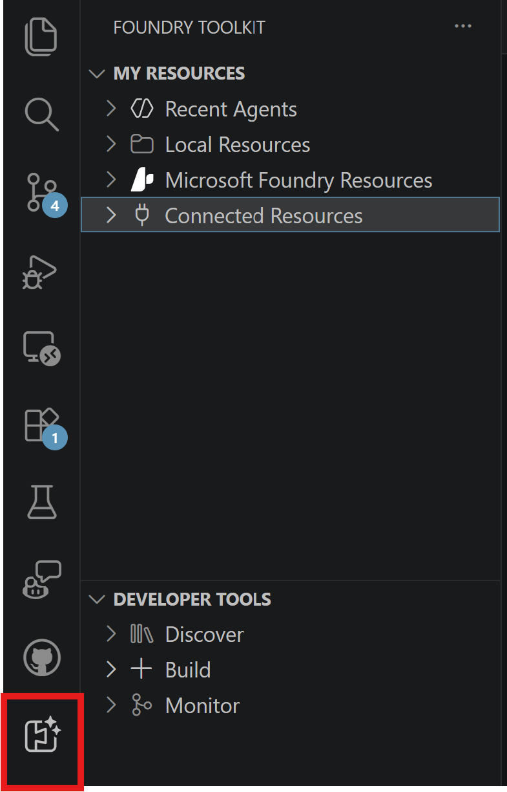

# Get started

!!! tip
    What is the **Foundry Toolkit**? [The Foundry Toolkit](https://code.visualstudio.com/docs/intelligentapps/overview) is an extension for Visual Studio Code that provides a unified interface to access and interact with various AI models and services. It allows users to easily explore, compare, and utilize different AI models from multiple providers, both proprietary and open source, hosted on several platforms, such as GitHub, Microsoft Foundry or even locally. With the Foundry Toolkit, developers can streamline their Generative AI development workflow by integrating model selection, prompt engineering, and agent prototyping and testing directly within their code editor.

## Open workshop in a GitHub Codespace

In this workshop, we will be using **GitHub Codespaces** to launch a cloud-hosted development environment with all the necessary tools and dependencies pre-installed. This will allow you to focus on learning and prototyping without worrying about local setup.

1. Open the browser and navigate to the [GitHub repo](https://github.com/carlotta94c/accelerate-ai-agents-development-with-gh-models-and-ai-toolkit) hosting the lab assets.

    !!! tip
        Click the Star button in the top right corner, this will help you easily find it later.

2. To launch a codespace, you need a **GitHub account**.

    !!! note
        If you already have a GitHub account, you can move to step 3 directly.

    To create one, click on the **Sign up** button and follow the instructions below:

    - In the new window, enter a personal email address, create a password, and choose a username.
    - Select your Country/Region and agree to the terms of service.
    - Click on the **Create account** button and wait for the verification email to arrive in your inbox.

    

    - Copy the verification code from the email and paste it into the verification field on the GitHub website. Then click on **Continue**.
    - Once the account is created, you'll be redirected back to the GitHub repo page and you'll see a green banner at the top, like the one in the screenshot below.

    

3. Click on **Sign in** and enter your GitHub credentials to log in. If you just created your account, use the username and password you set during the sign-up process.

4. Next, click on the green **Code** button and select **Create codespace on main** from the dropdown menu.

    

5. Once the codespace is created, you'll see a Visual Studio Code environment loading in your browser. You might choose to continue working in the browser or click on the **Open in VS Code** button to open it in the desktop application (if you have it installed in your machine).

    

!!! warning
    If you move to VS Code Desktop App, make sure the GitHub account you are logged in within VS Code is the same you used to create the GitHub Codespace.

## Set up the Azure AI Proxy

For this workshop, we will use an **Azure AI Proxy** that provides access to the latest AI models without requiring an Azure subscription. The proxy exposes OpenAI-compatible endpoints, so you can use it directly with the Foundry Toolkit.

1. Open a browser and navigate to the [Azure AI Proxy Registration](https://blue-beach-0df863010.7.azurestaticapps.net/event/be6b-7fab) page.

2. Click on **Login with GitHub** and authenticate using your GitHub account credentials.

3. Once logged in, you will see your **Event API Key** and the **Model Endpoints** available for this workshop. Copy both values — you will need them in the next step to configure the models in the Foundry Toolkit.

    !!! tip
        Keep this browser tab open or store the API key and endpoint URLs in a safe place (e.g., a text file in your Codespace), as you will need them throughout the workshop.

## Verify Foundry Toolkit extension is installed

In the GitHub Codespace, you should be able to see — among the Visual Studio Code extensions already installed — the **Foundry Toolkit**. This is the extension we will be using to interact with AI models and prototype agents in this lab.

!!! tip
    If you don't see the extension icon, click on the ellipsis (...) at the bottom of the sidebar to see the full list of installed extensions.

## Configure Custom Models in the Foundry Toolkit

Now that you have your API key and model endpoints from the Azure AI Proxy, configure the models in the Foundry Toolkit so you can use them throughout the workshop.

1. Click on the **Foundry Toolkit** icon in the left sidebar to open the extension panel.

2. Click on **Model Catalog** to open the catalog interface.

3. At the top of the Model Catalog, click **+ Add Model** (or the equivalent button to add a custom model endpoint).

4. When prompted, select **OpenAI Compatible** (or **Custom**) as the provider type.

5. For each model you want to configure, enter:
    - **Model Name**: `gpt-5.4` (for the first model) and `DeepSeek-V4-Pro` (for the second model)
    - **Endpoint URL**: the corresponding endpoint URL you copied from the Azure AI Proxy registration page
    - **API Key**: the Event API Key you copied from the Azure AI Proxy registration page

6. Confirm the configuration. The models will now appear in the **Model Catalog** under your custom provider and will be available for use in the Playground and Agent Builder.

    !!! note
        Repeat the configuration steps above for both `gpt-5.4` and `DeepSeek-V4-Pro`, using their respective endpoint URLs.

## Ready to start

That covers the necessary setup to work with the Foundry Toolkit in VS Code and Azure AI Proxy-hosted models. We will now move forward to begin exploring the Model Catalog and interacting with the models.
Click **Next** to proceed to the following section of the lab.
