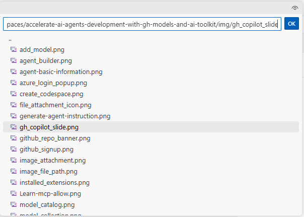

# Model Selection: Exploring the AI Toolkit Model Catalog

In this section, you will explore the AI Toolkit Model Catalog to discover, filter, and compare models for your multimodal agent project. The Model Catalog provides access to models from various providers including GitHub, Microsoft Foundry, OpenAI, and others.

## Step 1: Apply Filters to Narrow Your Selection

1. In your Codespace, locate the **AI Toolkit** extension icon in the left sidebar
2. Click on the AI Toolkit icon to open the extension panel
3. Click on **Model Catalog** to browse available models


On the top of the page you'll find the most popular models; scroll down to see the full list of available models.

Since the list is quite consistent, you can use the filtering options to narrow down the selection based on your requirements.

### Filter by Hosting Provider

1. Click on the **Hosted by** filter dropdown. You have several options, such as GitHub, Microsoft Foundry, OpenAI and you can even leverage models hosted on your local infrastructure, through Ollama or ONNX.
2. Select **GitHub** to view free-to-use models that are excellent for prototyping.

!!! note
    GitHub models are perfect for getting started because they're free to use, but they are token-rate limited. You can experiment without cost concerns, but for production deployments consider using a pay-as-you-go offering through your GitHub Account or Microsoft Foundry.

### Filter by Model Features

1. Click on the **Feature** filter dropdown to filter by model capabilities, such as image/audio or video processing, tool calling, etc.
2. Select **Image Attachment** to find multimodal models that support visual input processing and enables multimodal interactions combining text and images.

### Filter by Publisher

1. Click on the **Publisher** filter dropdown to filter by the model publisher, such as Microsoft, Meta, Cohere, etc. Note that you can find both open-source and proprietary models.
2. Select **OpenAI** and **Mistral AI** to view models from these two leading providers.

## Step 2: Add Models to Your Collection

After applying filters, you'll see a refined list of models. For this exercise:

1. Locate the **GPT-4.1** and **Mistral Small 3.1** models in the filtered results.
   - **GPT-4.1** is a full-featured multimodal model with comprehensive capabilities
   - **Mistral Small 3.1** is an optimized smaller model with faster response times and lower costs.
2. Click **Add model** on each model tile to add them to your collection.


!!! note
    Once they are added, the blue button will change to green with the label **Added**.

## Step 3: Open the Playground for Testing

1. Click on **Model Playground** in the AI Toolkit panel. The Playground allows you to test and compare models interactively.
2. You'll be prompted to login to your GitHub account to access the free-tier models. Click **Allow** and complete the authentication process, by using the same GitHub credentials you used in the previous lab section.

!!! tip
    Now that you are logged in, you should be able to see the models you added into your collection in the 'My resources' tab, under 'GitHub'. If you don't see them, click on the refresh icon to update the view.


3. In the **Model** field, select one of the two GitHub-hosted models you added to your collection, for example **Mistral Small 3.1 (via GitHub)**. It will be loaded into the Playground automatically.


!!! note
    You might experience some delay in model loading, especially if it's your first time accessing the Playground. Please be patient while the model initializes.

4. Next, click the **Compare** button to enable side-by-side comparison
5. From the dropdown, select your second model (GPT-4.1 if Mistral Small 3.1 is already selected)
6. You now have two models ready for comparison testing


## Step 4: Test Text Generation and Multimodal Capabilities

!!! tip
    The side-by-side comparison allows you to see exactly how different models handle the same input, making it easier to choose the best fit for your specific use case.

Let's start interacting with the models with a simple prompt:

1. Enter this prompt in the text field (where you see the placeholder "Type a prompt"):
   ```
   Create a short LinkedIn post about developer productivity with AI tools.
   ```
2. Click the paper airplane icon to execute the prompt on both models simultaneously


Now, test the models' image processing capabilities:

1. Enter this prompt in the text field:
   ```
   Extract the text from the attached image.
   ```

2. Click the image attachment icon to add a picture as input


3. Select an image file to upload. You'll be prompted with a text field with a default file path in your workspace directory. Replace it with the following:
   ```
   /workspaces/accelerate-ai-agents-development-with-gh-models-and-ai-toolkit/docs/img/gh_copilot_slide.png
   ```


4. Send the multimodal prompt on both models simultaneously.

Observe how each model handles the image input and the accuracy of the extracted text.

Next, let's test their reasoning capabilities, with the following prompt:

```
Create a content strategy plan for a social media management team currently focused on increasing awareness of AI-powered developer productivity tools. Include target audience and channels, key messages, content types, and a sample posting schedule for one week. Include rationale for your choices.
```

Look at how each model approaches the task, the depth of analysis, and the creativity in their strategies. Also, note the reasoning and justification provided in their responses.

## Step 5: Analyze and Compare Results

Review the outputs from both models, using several factors to guide your evaluation:

- **Response Quality**: Compare the depth and accuracy of descriptions, as well as the coherence with the input prompt.
- **Detail Level**: Which model provides more comprehensive analysis?
- **Processing Time**: Note any differences in response speed.
- **Output Formatting**: Evaluate clarity and organization of responses, as well as verbosity.
- **Token Usage**: Inspect the token usage for each model to understand cost implications. Note that token usage may vary not only based on the verbosity of the response but also on the tokenizer efficiency of each model.

!!! tip
    Number of output tokens is visible in the response footer, along with characters length.


### Leverage GitHub Copilot for Comparative Analysis
To assist with the comparative analysis, you can leverage GitHub Copilot to generate a comparison summary.

To access GitHub Copilot Chat, select the **Toggle Chat** icon at the top of the Visual Studio Code window.


!!! note
    If asked to log in at your first interaction with Copilot, select **Sign-in** -> **Continue with GitHub**. Then click on **Continue** to proceed with the GitHub account you used to access the GitHub hosted models, when redirected to the GitHub sign-in page.

Try the following prompt in the Copilot chat window:

```
I am exploring models for an AI agent that should support a social media management team creating content targeted to a developer audience, on different channels and formats. I am evaluating Mistral Small 3.1 and OpenAI GPT 4.1. Which one would you recommend for this scenario, and why? Explain the trade-offs between models (e.g., reasoning ability, cost, latency, context length) so that I can make an informed choice.
```

To answer this, Copilot calls the *Get AI Model Guidance* tool of the AI Toolkit, which provides model recommendations based on your use case. In the response, you should see an expandable section with the details of the tool call, followed by the comparative analysis.


!!! note
    If GitHub Copilot doesn't invoke the AI Toolkit tools when generating its response, you can enter `#aitk` in the chat window to explicitly select which tool(s) you'd like GitHub Copilot to use prior to submitting your prompt.

## Step 6: Select a Model for Next Steps

Once we are done with the comparison, we are going to select one of the two models for further prototyping in the next lab sections. For the sake of this exercise, let's go with **GPT-4.1**. 
Click on **Select this model** on the right side of the model name.


## Key Takeaways

- The Model Catalog provides a comprehensive view of available AI models from multiple providers
- Filtering capabilities help you quickly identify models that match your specific requirements
- Model comparison in the Playground enables data-driven decision making
- Different hosting options offer varying benefits for different stages of development
- Multimodal capabilities can be tested effectively using the built-in comparison tools

This exploration process ensures you select the most appropriate model for your specific use case, balancing factors like performance, cost, features, and deployment requirements.
Click **Next** to proceed to the following section of the lab.