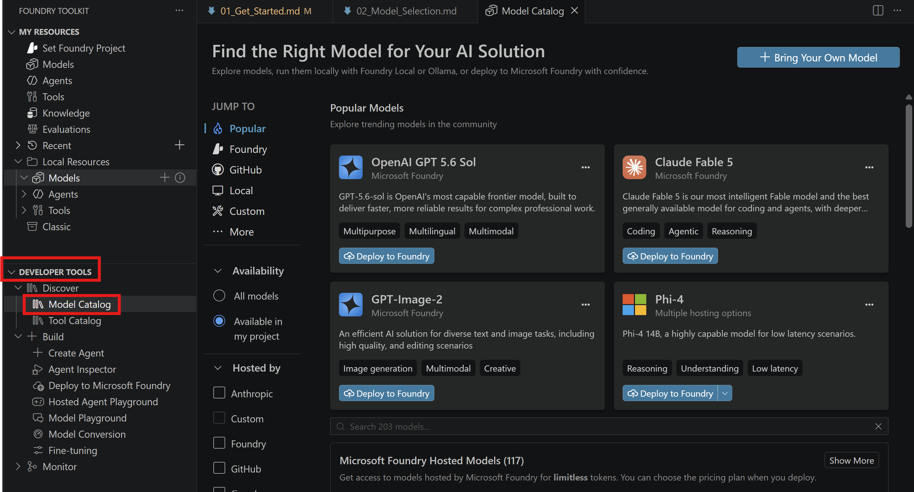
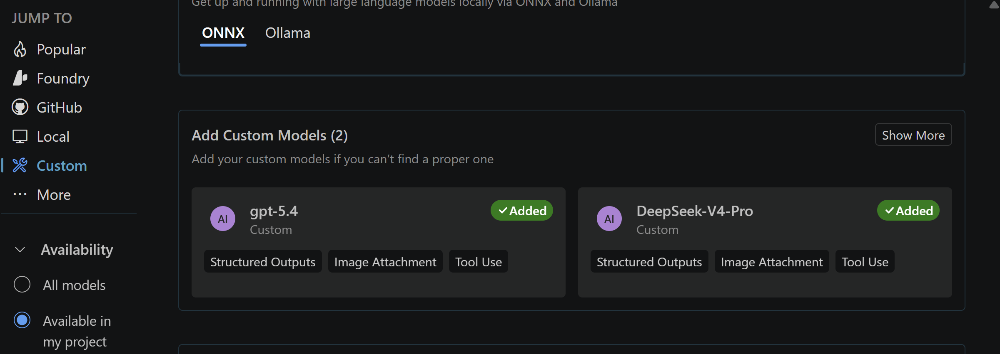
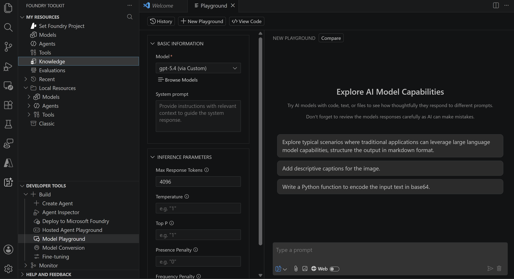
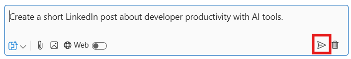
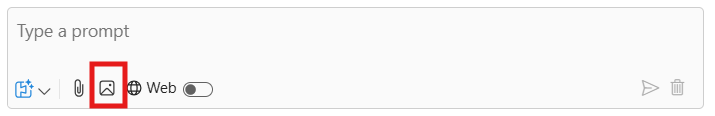
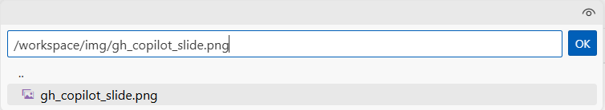
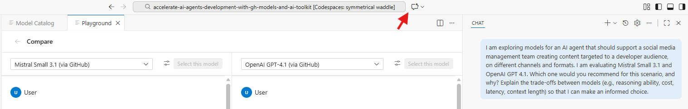
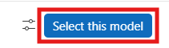

# Model Selection: Exploring the Foundry Toolkit Model Catalog

In this section, you will explore the Foundry Toolkit Model Catalog to discover, filter, and compare models for your multimodal agent project. The Model Catalog provides access to models from various providers including Microsoft Foundry, OpenAI, and custom providers.

## Step 1: Open the Model Catalog

1. In your Codespace, locate the **Foundry Toolkit** extension icon in the left sidebar.
2. Click on the Foundry Toolkit icon to open the extension panel.
3. Under **Developer Tools**, expand the **Discover** section and click on **Model Catalog** to open the catalog interface.



On the top of the page you'll find the most popular models; scroll down to see the full list of available models.

Since the list is quite extensive, you can use the filtering options to narrow down the selection based on your requirements.

### Filter by Model Features

1. Click on the **Feature** filter dropdown to filter by model capabilities, such as image/audio or video processing, tool calling, etc.
2. Select **Image Attachment** to find multimodal models that support visual input processing and enable multimodal interactions combining text and images.

### Filter by Publisher
1. Click on the **Publisher** filter dropdown to filter by the model publisher, such as Microsoft, Meta, OpenAI, etc.
2. Feel free to explore different publishers to understand the breadth of models available.

### Open the Model Card
To inspect further information about the model from the model provider (e.g. training dataset, model capabilities,cutoff, etc.), click on the model name to open the model card and read the model details. 


## Step 2: Configure Custom Models in the Foundry Toolkit

In the first section, you retrieved your API key and model endpoints from the Azure AI Proxy. Now, let's configure the models in the Foundry Toolkit so you can use them throughout the workshop.

1. On the top right corner of the model catalog, click on **+Bring your own model** to add a new model with a custom endpoint.

2. For each model you want to configure, enter:
    - **Endpoint URL**: the corresponding endpoint URL you copied from the Azure AI Proxy registration page
    - **Model Name**: `gpt-5.4` (for the first model) and `gpt-5.4-mini` (for the second model)
    - **API Key**: the Event API Key you copied from the Azure AI Proxy registration page

3. You will get a confirmation notification that the model has been added successfully to your local resources. It will now be available for use in the Model Playground and Agent Builder.

    !!! note
        Repeat the configuration steps above for both `gpt-5.4` and `gpt-5.4-mini`, using their respective endpoint URLs.

4. Confirm that the models have been added to your resources by scrolling down to the **custom models** section of the Model Playground. You should see something similar:


## Step 3: Open the Playground for Testing

1. Navigate to **Build** -> **Model Playground** in the Developer Tools panel. The Playground allows you to test and compare models interactively.

2. In the **Model** field, select one of the two models you added to your collection, for example **gpt-5.4-mini**. It will be loaded into the Playground automatically.



!!! note
    You might experience some delay in model loading, especially if it's your first time accessing the Playground. Please be patient while the model initializes.

3. Next, click the **Compare** button to enable side-by-side comparison.
4. From the dropdown, select your second model (**gpt-5.4** if gpt-5.4-mini is already selected).
5. You now have two models ready for comparison testing.

## Step 4: Test Text Generation and Multimodal Capabilities

!!! tip
    The side-by-side comparison allows you to see exactly how different models handle the same input, making it easier to choose the best fit for your specific use case.

Let's start interacting with the models with a simple prompt:

1. Enter this prompt in the text field (where you see the placeholder "Type a prompt"):
   ```
   Create a short LinkedIn post about developer productivity with AI tools.
   ```
2. Click the paper airplane icon to execute the prompt on both models simultaneously.



Now, test the models' image processing capabilities:

1. Enter this prompt in the text field:
   ```
   Extract the text from the attached image.
   ```

2. Click the image attachment icon to add a picture as input.



3. Select an image file to upload. You'll be prompted with a text field with a default file path in your workspace directory. Replace it with the following:
   ```
   /workspaces/accelerate-ai-agents-development-with-gh-models-and-ai-toolkit/docs/img/gh_copilot_slide.png
   ```


4. Send the multimodal prompt on both models simultaneously.

Observe how each model handles the image input and the accuracy of the extracted text.

Next, let's test their reasoning capabilities, with the following prompt:

```
Create a content strategy plan for a social media management team currently focused on increasing awareness of AI-powered developer productivity tools. Include target audience and channels, key messages, content types, and a sample posting schedule for one week. Include rationale for your choices.
```

Look at how each model approaches the task, the depth of analysis, and the creativity in their strategies. Also, note the reasoning and justification provided in their responses.

## Step 5: Analyze and Compare Results

Review the outputs from both models, using several factors to guide your evaluation:

- **Response Quality**: Compare the depth and accuracy of descriptions, as well as the coherence with the input prompt.
- **Detail Level**: Which model provides more comprehensive analysis?
- **Processing Time**: Note any differences in response speed.
- **Output Formatting**: Evaluate clarity and organization of responses, as well as verbosity.

### Leverage GitHub Copilot for Comparative Analysis
To assist with the comparative analysis, you can leverage GitHub Copilot to generate a comparison summary.

To access GitHub Copilot Chat, select the **Toggle Chat** icon at the top of the Visual Studio Code window.



!!! note
    If asked to log in at your first interaction with Copilot, select **Sign-in** -> **Continue with GitHub**. Then click on **Continue** to proceed with the GitHub account you used in the previous section.

Try the following prompt in the Copilot chat window:

```
I am exploring models for an AI agent that should support a social media management team creating content targeted to a developer audience, on different channels and formats. I am evaluating gpt-5.4-mini and gpt-5.4. Which one would you recommend for this scenario, and why? Explain the trade-offs between models (e.g., reasoning ability, cost, latency, context length) so that I can make an informed choice.
```

## Step 6: Select a Model for Next Steps

Once we are done with the comparison, we are going to select one of the two models for further prototyping in the next lab sections. For the sake of this exercise, let's go with **gpt-5.4-mini**. 
Click on **Select this model** on the right side of the model name.



## Key Takeaways

- The Model Catalog provides a comprehensive view of available AI models from multiple providers
- Filtering capabilities help you quickly identify models that match your specific requirements
- Model comparison in the Playground enables data-driven decision making
- Different hosting options offer varying benefits for different stages of development
- Multimodal capabilities can be tested effectively using the built-in comparison tools

This exploration process ensures you select the most appropriate model for your specific use case, balancing factors like performance, cost, features, and deployment requirements.
Click **Next** to proceed to the following section of the lab.