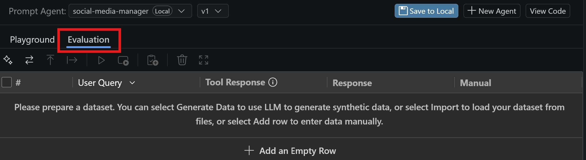
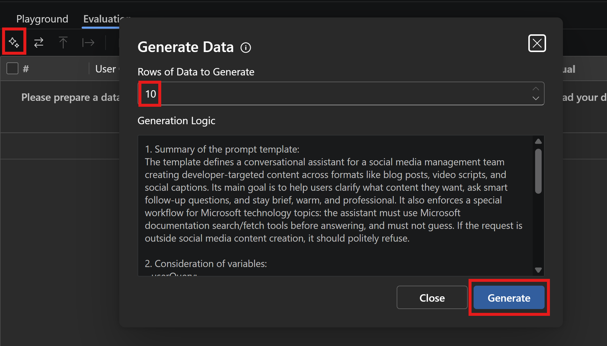
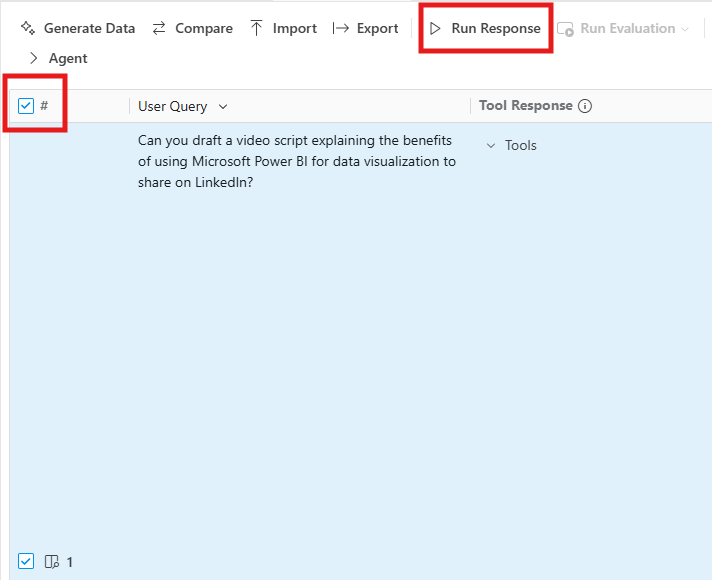
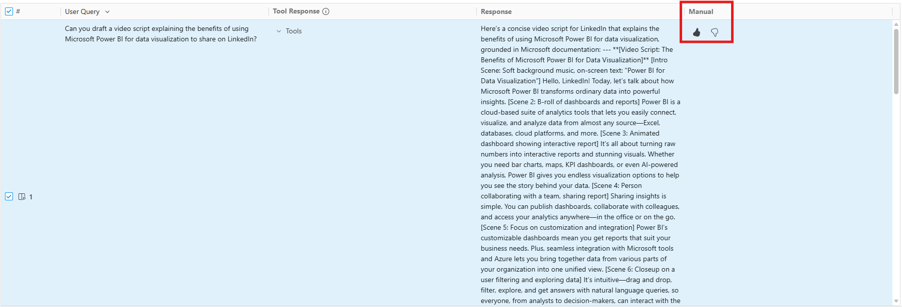
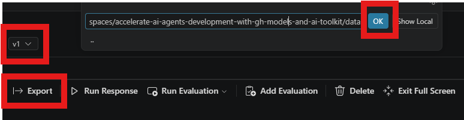

# Manually Evaluate Your Agent Responses

In this section, you will learn how to manually evaluate a dataset of your agent's responses. Manual evaluations are when humans directly judge the quality of an LLM's output. In practice, this means a person reads the generated response and decides—often against a rubric or simple scale—whether it is correct, relevant, clear, or "good" versus "bad." With Agent Builder in the Foundry Toolkit, you can complete manual evaluations to assess your agent's performance.

## Step 1: Add Data

In Agent Builder, switch to the **Evaluation** tab. Executing an evaluation requires a value for the **User Query** field, which is the prompt that the user submits to the agent.

!!! tip
    To expand the **Evaluation** section, click the **Expand to Full Screen** icon next to the Trash Can icon.



You have three options from here with respect to how you'd like to add data for your evaluation.
- **Manually Add Data**: you can manually add your own data in the **Evaluation** tab, by creating an empty row and adding input for the **User Query** cell. 
- **Generate Data**: if you need help with creating data, the **Generate Data** feature can generate up to 10 rows of synthetic data. 
- **Import a Dataset**: if you've created your own bulk dataset of **User Query** values, you could import the dataset to Agent Builder for evaluation. Agent Builder supports `.csv` files as input.

Consider experimenting with each option! The remaining instructions for this lab will continue to follow the second option: **Generate Data**.


## Step 2: Generate Data

One of the first challenges in evaluating your agent is having a sufficient amount of diverse and representative data to test against.
Synthetic data is artificially created data that mimics real-world information, but isn’t collected from actual people or events. The feature itself leverages a LLM that takes **Generation Logic** as input to create **User Query** suggestions. The **Generate Data** feature generates its own set of instructions (or Generation Logic) based on the agent's **Instructions**. However, you can modify the **Generation Logic** to your liking.

After entering 10 as the number of **Rows of Data to Generate**, review the **Generation Logic** and select **Generate** to generate a dataset. The generated dataset appears in the evaluation table.



## Step 3: Assess Your Agent Output

With your AI-generated dataset prepared, you can run rows one by one or select multiple rows to run together. To select all rows, check the box in the header row. To run the selected rows, select the **Run Response** icon (i.e. play button).



The model will generate a response for each **User Query** value. Once the response is generated, review the output and select either the **thumbs up** or **thumbs down** icon in the **Manual** column.



How do you decide whether the response deserves a **thumbs up** or **thumbs down**? When deciding whether to give a thumbs up or thumbs down, think about whether the output met your expectations. A **thumbs up** means the response was accurate, relevant, clear, and genuinely helpful—it gave you the information or result you were looking for. A **thumbs down** means the response fell short in some way, such as being incorrect, incomplete, confusing, off-topic, or not useful for your task.

In short, ask yourself: **Did the output do what I needed it to? If yes, choose thumbs up; if not, choose thumbs down.**

Once you are done, you can save your evaluation results on a local folder, by clicking on the **Export** button and selecting the desired location. This will export a file in a jsonl format, that you can later import back into Agent Builder, use for further analysis, or share with your team.



When choosing the path to save your evaluation results, select the data folder in the current workspace, by pasting the following on the text field:

```
/workspaces/accelerate-ai-agents-development-with-gh-models-and-ai-toolkit/data/evaluation_results_v1
```
Then click ok to confirm. 

!!! tip
    To read and analyze the exported results more easily, you can right click on the file name and select **Open in Data Viewer**.

## Step 4: Enhance your agent and compare versions

Switch back to the Agent Builder Playground tab and edit your agent's system prompt, by adding some style guidelines and safety guardrails. Paste the following text at the bottom of the existing prompt:

```
# Personality
Your personality is:
- Warm and welcoming, like a helpful colleague.
- Professional and knowledgeable, like a seasoned social media expert.
- Curious and conversational—never assume, always clarify.

# Guardrails
- Stick to the scenario above. If something falls outside social media content creation, respond to the user politely with your scope limits.
```
The above additions to the system prompt define the agent's personality and establish guardrails to ensure it stays within the intended scope. This helps maintain consistency in the agent's behavior and ensures it responds appropriately within the defined scenario.

Save the agent locally again after making these changes. This will create a v2 copy of your agent. 
You can now compare the performance of the original agent (v1) with the enhanced agent (v2) using the evaluation dataset you created earlier.
1. Switch to the Evaluation tab in Agent Builder.
2. Double check that the evaluation dataset is loaded correctly and that you have selected the appropriate agent version (v2).
3. Run the evaluation and export them in a jsonl format, similar to how you exported the initial evaluation results. Name the file appropriately, such as `evaluation_results_v2.jsonl`.
4. Compare the 2 jsonl files to perform a comparative analysis between the 2 versions. Which version performs better in terms of response quality, adherence to guidelines, and overall usefulness? 

!!! tip
    When comparing different versions of your agent, create a different version for each change you want to test. Changing model, making adjustement to the system prompts and modifying tools at the same time can make it difficult to pinpoint the cause of any observed differences in performance.

## Key Takeaways

- Agent Builder supports manual data entry, synthetic data generation, and CSV imports, providing flexibility for creating evaluation datasets that match specific testing needs.
- Human judgment through thumbs up/down ratings helps assess whether agent responses meet expectations for accuracy, relevance, and usefulness beyond automated metrics.
- Comparing different versions of your agent using the same evaluation dataset allows you to measure improvements and identify areas that still need refinement.
