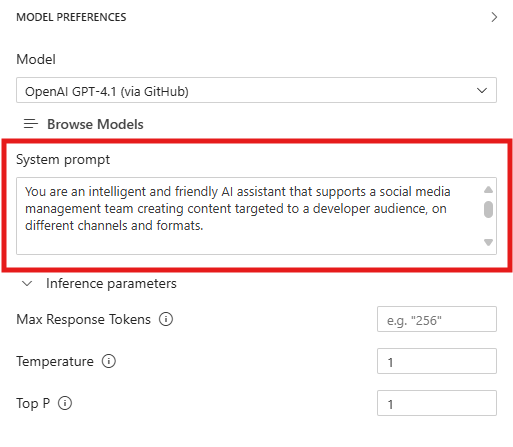
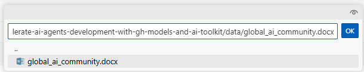

# Model Augmentation: Enhancing Context for Improved Performance

In this section, you will learn how to augment your selected model using prompt engineering and context data to improve its performance and relevance to your specific use case. This is a crucial step in tailoring AI models to meet the unique needs of your business scenario.

## Step 1: Crafting the System Message

The system message is a critical component of the prompt that sets the behavior and context for the AI model. It helps the model understand its role and the specific requirements of the task at hand. Here are some key considerations for crafting an effective system message:

1. **Be Clear and Concise**: Clearly articulate the purpose of the interaction and the desired outcome. Avoid ambiguity to ensure the model understands the task.

2. **Provide Context**: Include relevant background information or context that will help the model generate more accurate and context-aware responses.

3. **Set Expectations**: Specify any constraints or requirements for the response, such as format, length, or style.

4. **Break Down Complex Instructions**: If the task is complex, consider breaking it down into simpler, step-by-step instructions to guide the model effectively.

In the **System Prompt** field of the Playground, in the right pane, enter the following system message:

```
You are an intelligent and friendly AI assistant that supports a social media management team creating content targeted to a developer audience, on different channels and formats.

# Task
Your role is to:
- Engage with users in natural conversation to understand their social media content creation goals.
- Ask thoughtful questions to gather relevant project details.
- Be brief in your responses.

Content Formats:
- Blog: Informative or narrative articles, structured with an introduction, body, and conclusion.
- Video Script: Text for videos, including directions for scenes, dialogues, and actions.
- Post Captions: Short and catchy texts to accompany images or videos on social media.

# Personality
Your personality is:
- Warm and welcoming, like a helpful colleague.
- Professional and knowledgeable, like a seasoned social media expert.
- Curious and conversational—never assume, always clarify.

# Guardrails
- Stick to the scenario above. If something falls outside social media content creation, respond to the user politely with your scope limits.
```



Note that this message includes:
- A clear definition of the assistant's **role and responsibilities** ("You are an AI assistant that supports a social media management team...")
- Specific instructions on **how to interact with users** and what to focus on (e.g., "Engage with the users in natural conversation...")
- Guidelines on **tone and style** to ensure consistent and appropriate responses (e.g., "Warm and welcoming, like a helpful colleague...")
- Safety **guardrails** to keep the assistant focused on relevant topics ("Stick to the scenario above...")

## Step 2: Testing the System Message with Multimodal Input

Now that we configured the system prompt, let's test the system with a user prompt. Attach again the [same image](../img/gh_copilot_slide.png) of the github copilot slide we used in the [previous section](./02_Model_Selection.md), and combine it with the following user prompt:

```
Create a short LinkedIn post about developer productivity with the tool illustrated in the attached image.
```

The model will analyze the image and provides a suggestion for a LinkedIn post that aligns with the user's request and the guidelines set in the system message. Note how there's no reference to GitHub Copilot in the system message or the user prompt, yet the model is able to identify the tool in the image and incorporate it into the response.

Let's now test the model with a user query which is not relevant to the given scenario. Enter the following prompt:

```
What’s the weather like in Messina today? 
```

The model should politely inform the user that it can only assist with social media content creation, demonstrating its ability to follow the guidelines set in the system message.

## Step 3: Adding Grounding Data

In addition to the system message, providing context data can significantly enhance the model's ability to generate relevant and accurate responses. Context data can include information about your business, products, services, or any other relevant details that can help the model better understand the scenario.

For our use case, we are going to provide the model with some context about the [Global AI Community](https://globalai.community/), the largest worldwide developer community focused on AI, with a special focus on the local chapters based in Italy.

To add grounding data, we will use the **file attachment** feature in the Playground. This allows us to upload documents that the model can reference when generating responses.

The document we are going to upload is a .docx file, containing information about the Global AI Community, including its mission, some key statistics and its presence in Italy. You can find the file in the `/workspace/data/` directory of your AITK environment, named `global_ai_community.docx`.

1. Click the file attachment icon in the prompt input area.

2. Select the file `global_ai_community.docx` from the `/workspace/data/` directory.

!!! tip
	In the text field that appears, you can enter the following path to the file:

	```
	/workspace/data/global_ai_community.docx
	```



3. Once the file is uploaded, it will appear as an attachment below the prompt input area.
4. Enter the following prompt in the text field:
```
Create a short LinkedIn post to promote the Global AI Community and its activities.
```

The model will analyze the uploaded document and provide a grounded suggestion for a LinkedIn post that highlights the Global AI Community's mission, key statistics, and its presence in Italy.

What happens behind the scenes is that the attached data are automatically included in the prompt context, enabling the model to generate more informed and relevant responses.

Of course this approach has its limitations, as the model can only process a limited amount of text in the prompt context, and the larger is the attached context the higher is the response latency and cost. For larger datasets or more complex scenarios, you need to implement a more sophisticated retrieval mechanism to ensure the model prompt includes only the most relevant information for the current user query. We are going to explore this in more detail in the next section of this workshop.

## Key Takeaways
- Crafting an effective system message is crucial for guiding the model's behavior and ensuring relevant responses.
- Providing context data through file attachments can significantly enhance the model's performance and relevance.
- Testing the model with multimodal input helps validate the effectiveness of the system message and context data.
- Grounding data should be relevant and concise to fit within the model's input limitations.

Click **Next** to proceed to the following section of the lab.