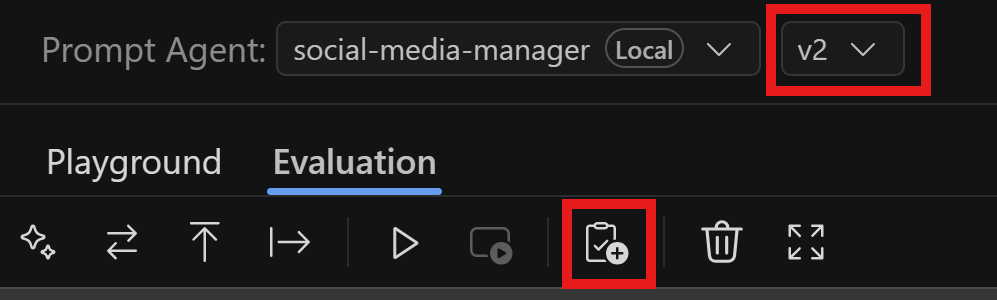
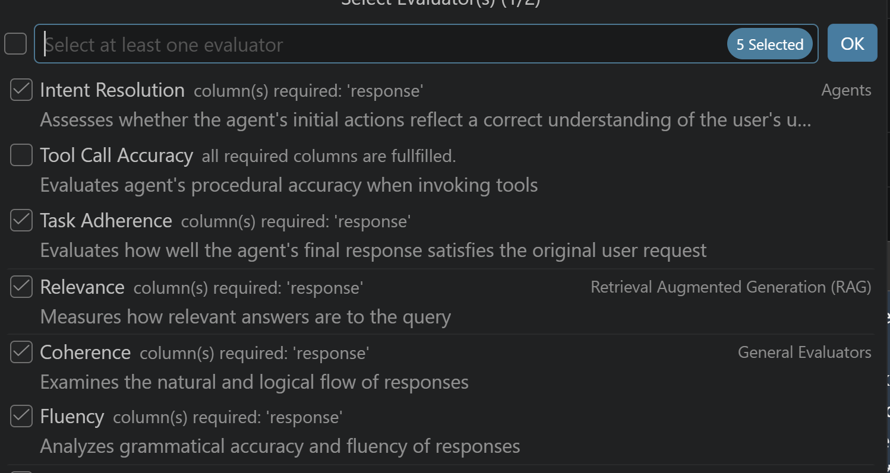
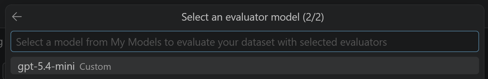
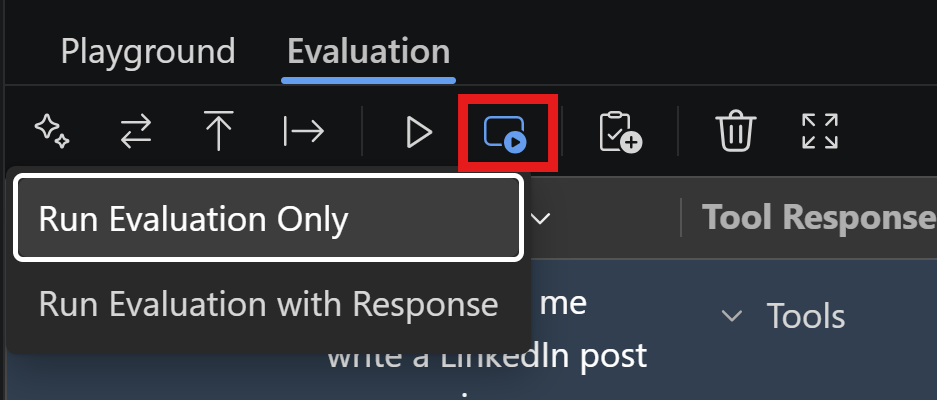

#  Automate Evaluation of Your Agent Responses

Manual evaluation helps uncover nuanced issues in an agent’s reasoning, tone, and usefulness. As test cases grow, AI-assisted evaluation can scale this assessment consistently and efficiently. These approaches are complementary: human judgment provides depth and context, while AI-assisted evaluation provides broader coverage. Together, they offer a more complete assessment of an agent’s quality.

In this section, you will learn how to leverage AI-assisted evaluation to automate the assessment of your agent's responses, complementing manual evaluations for a more comprehensive understanding of your agent's performance.

## Step 1: Enable AI-Assisted Evaluation

In the **Evaluation** tab of Agent Builder, ensure you have the v2 selected of your social-media-manager agent. Follow the steps below to enable AI-assisted evaluation:

1. Click on the **Add Evaluation** button.

2. In the dialog that appears, select the metrics you want to evaluate. For the sake of this lab we are going to select:
    - Intent Resolution: Evaluates whether the agent correctly understood and addressed the user's intent.
    - Task Adherence: Evaluates whether the agent followed the expected steps and procedures to complete the task.
    - Relevance: Evaluates whether the agent's responses are contextually appropriate and pertinent to the user's query.
    - Coherence: Evaluates whether the agent's responses are logically structured and easy to follow.
    - Fluency: Evaluates whether the agent's responses are well-formed, grammatically correct, and easy to read.
3. Click **Ok** to confirm your selection.

4. Next, you'll be prompted to choose the model you want to use for the AI-assisted evaluation (LLM-as-a-judge). This model will evaluate your agent against the provided dataset and generate scores for the selected metrics. Choose the gpt-5.4-mini model instance we configured earlier in the workspace.

5. Finally, to actually initiate the AI-assisted evaluation, click the **Run Evaluation** button and select **Run Evaluation Only** as we already got the agent's responses from previous steps.

The evaluation will take a few minutes. Once complete, you should see all the new columns corresponding to the selected evaluation metrics populated with the AI-generated scores. Per each metric, you'll see:
- A numeric score representing the agent's performance for that metric in a range from 0 to 5.
- A reason explaining the score, providing context and justification for the evaluation.

This structured feedback allows you to quickly identify strengths and weaknesses in your agent's performance, guiding further improvements and refinements.
Also, compare the AI-assisted evaluation results with your manual evaluations: are they aligned? Is there any nuance that the AI might have missed or interpreted differently?

Similarly, to what you have done with manual evaluations, you can export the AI-assisted evaluation results for further analysis or record-keeping.

## Key Takeaways

- AI-assisted evaluation can significantly speed up the assessment process, especially as the number of test cases grows.
- Human judgment remains crucial for capturing nuanced aspects of an agent's performance that AI might overlook.
- Combining manual and AI-assisted evaluations provides a more comprehensive understanding of your agent's strengths and weaknesses.
- Regularly reviewing and updating evaluation metrics ensures that the assessment remains aligned with your agent's goals and user expectations.

