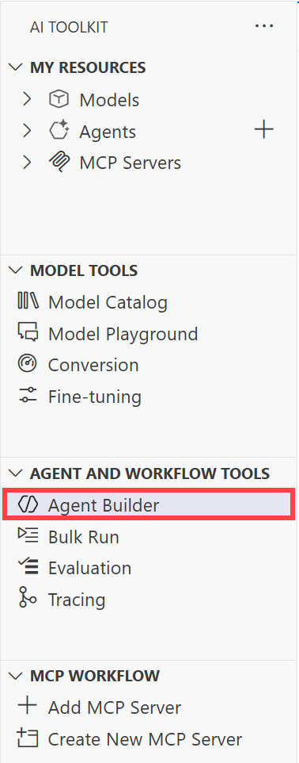
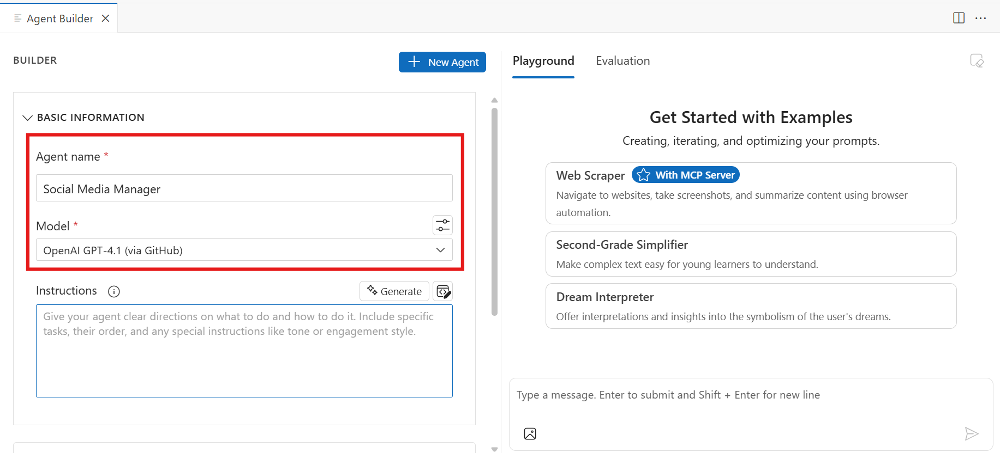
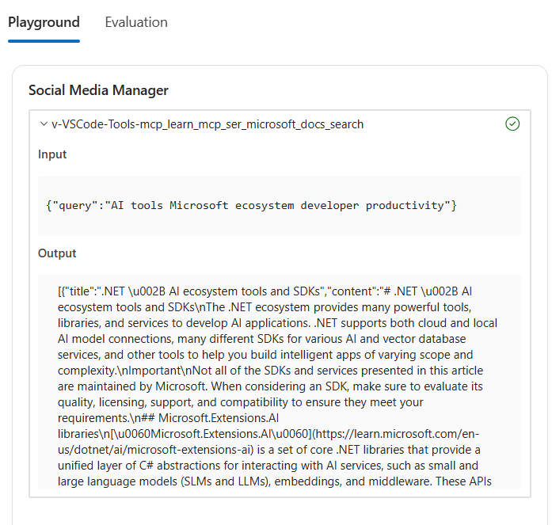
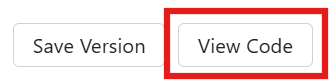

# Agent Building: Building an AI Agent with Agent Builder

In this section, you will learn how to create an AI agent with Agent Builder in the AI Toolkit and equip it with tools, enabling it to take actions on behalf of the user. Agent Builder streamlines the engineering workflow for building agents, including prompt engineering and integration with tools, such as MCP servers.

!!! tip
   [Model Context Protocol (MCP)](https://modelcontextprotocol.io/docs/getting-started/intro) is a powerful, standardized framework that optimizes communication between Large Language Models (LLMs) and external tools, applications, and data sources.

## Step 1: Explore Agent Builder

To access Agent Builder, in the AI Toolkit view, select **Agent Builder**.



Agent Builder's UI is organized into two sections. The left side of Agent Builder enables you to define the basic information for the agent such as its name, model choice, instructions, and any relevant tools. The right side of Agent Builder is where you can both chat with the agent and evaluate the agent's responses.

## Step 2: Create the Agent

In **Agent Builder** configure the new agent's basic information. Within the **Agent name** field, enter **Social Media Manager**. For the agent's **Model**, select the **OpenAI gpt-4.1 (via GitHub)** model.



## Step 3: Provide Instructions for the Agent

Similarly to what we've previously done in the Model Playground, we'll now need to define the behavior of the agent, through the system prompt. 

!!! tip
   The Agent Builder provides a **Generate** feature that uses a large language model (LLM) to generate a set of instructions from a description of your agent's task. This feature is helpful if you need guidance in crafting the agent's instructions.

   

For the sake of this exercise, we'll leverage a set of instructions similar to the one used in the previous section:

```
You are an intelligent and friendly AI assistant that supports a social media management team creating content targeted to a developer audience, on different channels and formats.

# Task
Your role is to:
- Engage with users in natural conversation to understand their social media content creation goals.
- Ask thoughtful questions to gather relevant project details.
- Be brief in your responses.

Content Formats:
- Blog: Informative or narrative articles, structured with an introduction, body, and conclusion.
- Video Script: Text for videos, including directions for scenes, dialogues, and actions.
- Post Captions: Short and catchy texts to accompany images or videos on social media.

# Personality
Your personality is:
- Warm and welcoming, like a helpful colleague.
- Professional and knowledgeable, like a seasoned social media expert.
- Curious and conversational—never assume, always clarify.

# Steps
Think step-by-step:
1. Analyze the user's query to determine if it requests content about Microsoft technologies or tools.
2. If YES:
   - Plan what information is needed and select the appropriate MCP learn server tools to gather Microsoft documentation.
   - Use "mcp_learn_mcp_ser_microsoft_docs_search" to identify relevant official Microsoft sources.
   - If highly valuable/relevant pages emerge, follow up with "mcp_learn_mcp_ser_microsoft_docs_fetch" to retrieve the full content.
   - Persist in using these tools until the answer is factually grounded and complete. Only terminate your turn when the problem is solved.
   - DO NOT guess, invent, or proceed without tool results. Use your tools to learn any missing details.
3. If NO:
   - Proceed with general content creation and strategy for developer audiences, as specified by user.
4. If the user asks for something outside social media content strategy, politely inform them you cannot assist outside of social media content creation.

# Tool Use Guidelines
- Always use MCP learn server tools ("docs_search", "docs_fetch") for Microsoft tech topics to ground your response.
- Never guess or fabricate information about Microsoft technologies or tools.
- If unsure about any details, always use the server tools to find out. Do not rely on assumptions.
- Continue querying and planning with tools until your answer is fully supported and grounded.
- Only finish your turn when the user’s query is fully resolved and content is complete.

# Guardrails
- Stick to the scenario above. If something falls outside social media content creation, respond to the user politely with your scope limits.
```

Note how we added a couple of new sections to the instructions:
- A **Steps** section that guides the agent on how to approach user queries, including when and how to use the MCP tools.
- A **Tool Use Guidelines** section that provides specific rules for using the MCP tools effectively.

## Step 4: Add Tools to the Agent

### Start the Microsoft Learn MCP server

Earlier in the **Model Augmentation** exercise, we added grounding data to the model in the form of a .docx file attachment. While that may have been convenient for the sake of testing the base model prior to model selection, what we'd recommend is to ground the agent with data in such a way that's scalable to larger datasets and always up-to-date information.

To achieve this, we can use the **Model Context Protocol (MCP)** server to provide the agent with access to relevant data sources. This allows the agent to retrieve up-to-date information and context as needed. The retrieval of relevant information is handled automatically by the MCP server, which communicates with the agent via the MCP standard, so that the agent can focus on generating responses based on the most relevant and current data.

This project already includes the configuration to run the remote [Microsoft Learn MCP server](https://github.com/microsoftdocs/mcp), which exposes search tools to query the [Microsoft Learn](https://learn.microsoft.com/) documentation and search for official Microsoft/Azure code samples.

To start the **Microsoft Learn** server, within your codespace, navigate to `.vscode/mcp.json`. Within the `mcp.json` file, locate the `Learn MCP Server` and click **Start** above the server.


!!! note
   Once the server is started, you should see the status change to **Running**.

### Add search tools to the agent

Once the server is running, return to Agent Builder. In the **Tool** section, click on the **+** button and then select **MCP server**.


Next, select **Use tools added in Visual Studio Code**.


Make sure you have the `mcp_learn_mcp_ser_microsoft_docs_search` and `mcp_learn_mcp_ser_microsoft_docs_code_search` tools selected, then click **Ok**.


## Step 5: Test tools integration

Now that the tools have been added to the agent, let's test them out. In the playground input area - where you see the placeholder `Type a message.`, enter the following prompt:

```
Create five short LinkedIn posts about the advantages of using AI tools from the Microsoft ecosystem for developer productivity.
```

In addition to the agent's response, you should see the details of the tool invocations within the chat area. Expand the details of the tool calls to see how the agent used the MCP tools to search for relevant Microsoft Learn documentation and code samples to ground its response.



## Step 6: Extract the Agent's Code

!!! note
   Agent evaluation is a crucial step in the agent development process, prior to deployment. It allows you to assess the agent's performance, identify areas for improvement, and ensure that it meets the desired objectives. This lab is not going to cover agent evaluation in detail, but you can learn more about it in the [official documentation](https://code.visualstudio.com/docs/intelligentapps/evaluation).

Once you have your agent prototype ready and tested, you can export it to code that can be integrated into your applications. To do this, simply click on the **View code** button at the bottom of the Agent Builder interface.



## Key Takeaways

In this section, you learned how to create an AI agent with Agent Builder in the AI Toolkit and equip it with tools via Model Context Protocol (MCP). You leveraged the Microsoft Learn MCP server to provide the agent with access to relevant data - the Microsoft official docs, allowing it to retrieve up-to-date information and context as needed.

Click **Next** to proceed to the following section of the lab.