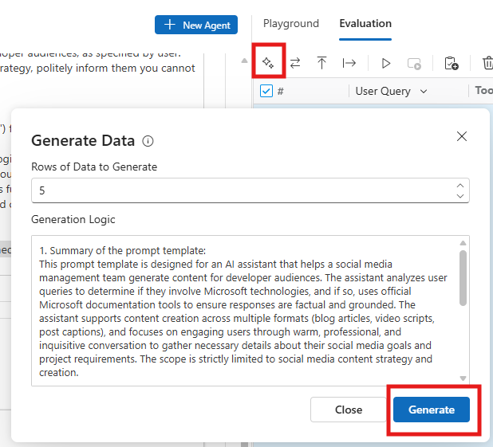
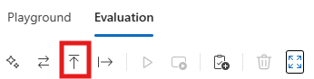
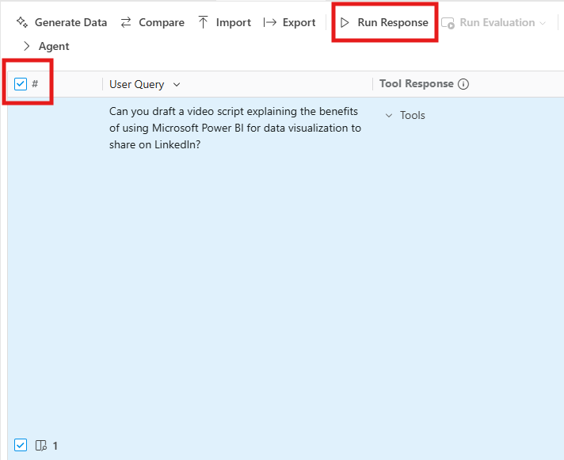

# Bonus: Manually Evaluate Your Agent Responses

!!! note
    This is a bonus section you can complete if you still have time during the allotted lab slot. Otherwise, you are more than welcome to go through it at your own pace once back home.

In this section, you will learn how to manually evaluate a dataset of your agent's responses. Manual evaluations are when humans directly judge the quality of an LLM’s output. In practice, this means a person reads the generated response and decides—often against a rubric or simple scale—whether it is correct, relevant, clear, or “good” versus “bad.” With Agent Builder, you can complete manual evaluations to assess your agent’s performance.

## Step 1: Add Data

In Agent Builder, switch to the **Evaluation** tab. Executing an evaluation requires a value for the **User Query** field, which is the prompt that the user submits to the agent.

You have a couple of options from here with respect to how you'd like to add data for your evaluation.

!!! tip
    To expand the **Evaluation** section, click the **Expand to Full Screen** icon next to the Trash Can icon.

**Manually Add Data**

You can manually add your own data in the **Evaluation** tab, by creating an empty row and adding input for the **User Query** cell. 

!!! tip
    Use the **Add an Empty Row button** to create each row of the table and then double-click on a cell to edit its content.

**Generate Data**

If you need help with creating data, the **Generate Data** feature can generate up to 10 rows of synthetic data. Synthetic data is artificially created data that mimics real-world information, but isn’t collected from actual people or events. The feature itself leverages a LLM that takes **Generation Logic** as input to create **User Query** suggestions. The **Generate Data** feature generates its own set of instructions (or Generation Logic) based on the agent's **Instructions**. However, you can modify the **Generation Logic** to your liking.

After entering 5 as the number of **Rows of Data to Generate**, review the **Generation Logic** and select **Generate** to generate a dataset. The generated dataset appears in the evaluation table.

**Import a Dataset**

If you've created your own bulk dataset of **User Query** values, you could import the dataset to Agent Builder for evaluation. Agent Builder supports `.csv` files as input.

Consider experimenting with each option! The remaining instructions for this lab will continue to follow the second option: **Generate Data**

## Step 3: Assess Your Agent Output

With your AI-generated dataset prepared, you can run rows one by one or select multiple rows to run together. To select all rows, check the box in the header row. To run the selected rows, select the **Run Response** icon (i.e. play button).

The model will generate a response for each **User Query** value. Once the response is generated, review the output and select either the **thumbs up** or **thumbs down** icon in the **Manual** column.

How do you decide whether the response deserves a **thumbs up** or **thumbs down**? When deciding whether to give a thumbs up or thumbs down, think about whether the output met your expectations. A **thumbs up** means the response was accurate, relevant, clear, and genuinely helpful—it gave you the information or result you were looking for. A **thumbs down** means the response fell short in some way, such as being incorrect, incomplete, confusing, off-topic, or not useful for your task.

In short, ask yourself: **Did the output do what I needed it to? If yes, choose thumbs up; if not, choose thumbs down.**

## Key Takeaways

- Agent Builder supports manual data entry, synthetic data generation, and CSV imports, providing flexibility for creating evaluation datasets that match specific testing needs.
- Human judgment through thumbs up/down ratings helps assess whether agent responses meet expectations for accuracy, relevance, and usefulness beyond automated metrics.